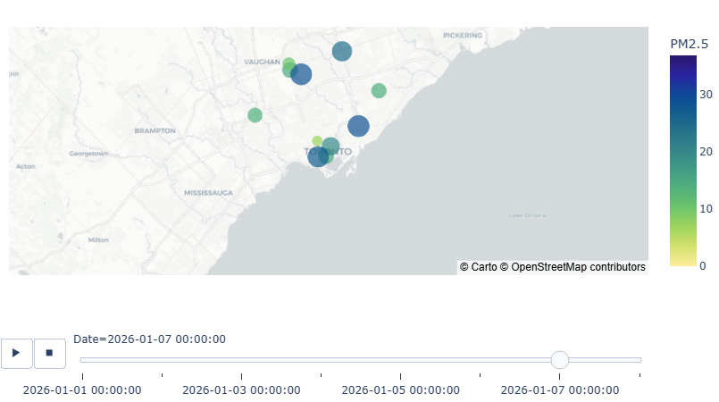

# Spatiotemporal PM2.5 Analysis (GTA)

This project focuses on analyzing and visualizing PM2.5 air pollution data in the Greater Toronto Area (GTA). It automates data ingestion, processes geospatial data, and generates animated pollution maps to provide insights into air quality trends over time.

## Features

- **Automated Data Ingestion**: Fetches air quality data from OpenAQ.
- **Geospatial Processing**: Processes and analyzes spatial data for the GTA.
- **Visualization**: Creates animated maps to visualize PM2.5 pollution over time.
- **Future Enhancements**:
  - Forecasting air quality trends.
  - Interactive dashboard for real-time monitoring.

