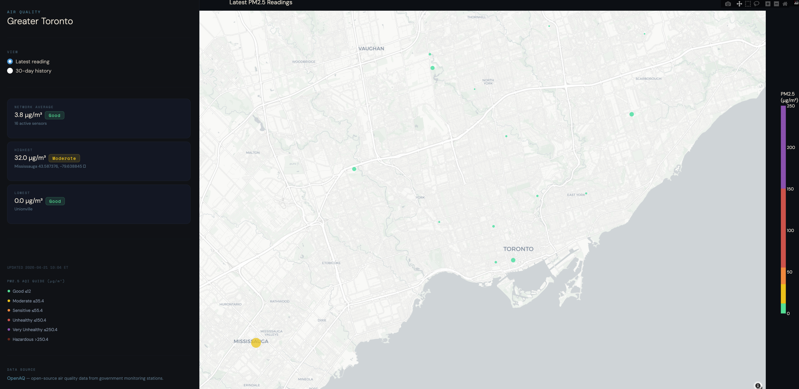

# Spatiotemporal PM2.5 Analysis (GTA)

This project focuses on analyzing and visualizing PM2.5 air pollution data in the Greater Toronto Area (GTA). It automates data ingestion, processes geospatial data, and generates animated pollution maps to provide insights into air quality trends over time.

## Features

- **Automated Data Ingestion**: Fetches air quality data from OpenAQ.
- **Interactive Dashboard**: Provides real-time monitoring of air quality.
- **In progress Enhancements**:
  - Forecasting air quality trends.
  - Geospatial Processing: Enhancing spatial analysis capabilities.

[Check out the interactive dashboard on Hugging Face Spaces](https://huggingface.co/spaces/astroAycha/gta-air-quality)

